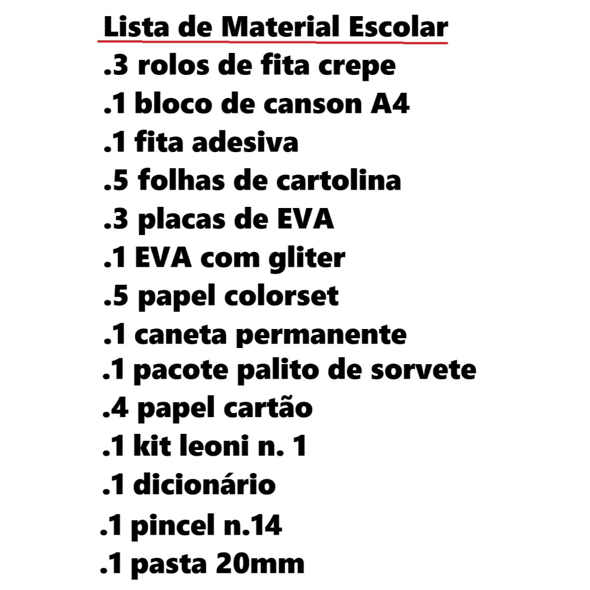

# Transcrevendo uma Imagem em Texto com AWS Textract

O objetivo do projeto consistia em extrair o texto de uma imagem utilizando o AWS Textract.

Porém, para não correr o risco de ser cobrado, adaptei o projeto para realizar a extração direto do arquivo JSON disponibilizado no repositório do Bootcamp.

Com isso pude pular a etapa que utilizava o serviço AWS Textract. E como tentativa de compensar, realizei uma pequena formatação no texto de exibição.

As formatações realizadas foram:
- Alterar o primeiro ponto por traço
- Transformar a primeira letra de cada item em maiúscula

Repositório do Bootcamp: https://github.com/digitalinnovationone/nexa-analise-avancada-de-imagens-e-texto-com-ia-na-aws

## Imagem

## Resultado

\------------------------------ 
Lista de Material Escolar 
\- 3 Rolos de fita crepe 
\- 1 Bloco de canson A4 
\- 1 Fita adesiva 
\- 5 Folhas de cartolina 
\- 3 Placas de EVA 
\- 1 EVA com gliter 
\- 5 Papel colorset 
\- 1 Caneta permanente 
\- 1 Pacote palito de sorvete 
\- 4 Papel cartão 
\- 1 Kit leoni n. 1 
\- 1 Dicionário 
\- 1 Pincel n.14 
\- 1 Pasta 20mm 
\------------------------------
